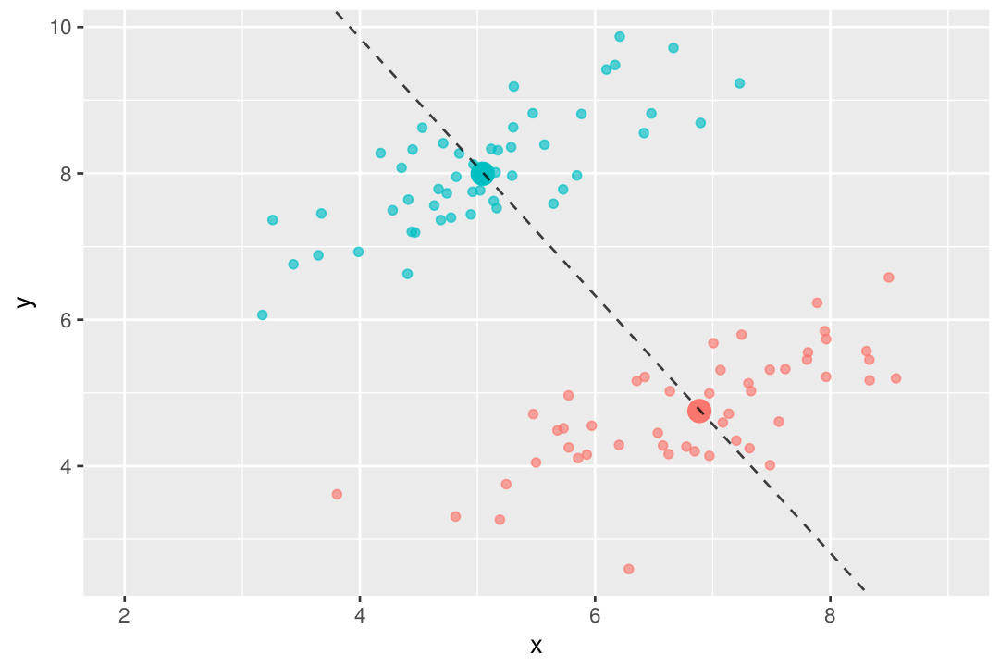
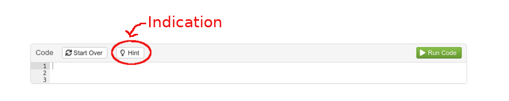
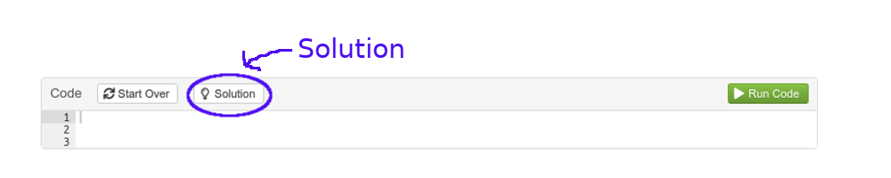
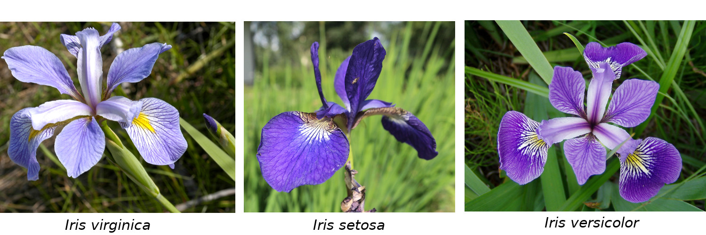

```{r setup, include=FALSE}
knitr::opts_chunk$set(echo = TRUE)
library(learnr)
library(fontawesome)
library(dplyr)
library(MASS)
library(ggplot2)
digits <- readRDS("data/digits.rds")
insects <- read.table("data/insectes.txt")
```


## 1. Introduction

On s'intéresse dans ce TP à l'analyse factorielle discriminante (AFD). On étudiera pour cela trois jeux de données différents, dont un jeu de données contenant des images à classer.

**La fonction R permettant de faire une AFD ets la fonction `lda` du package `MASS`. Il y a aussi la fonction `discrimin` du package `ade4`, qui s'utilise un peu différemment. Nous verrons les deux fonctions.**

{ width=70% }

*Illustration de l'analyse factorielle discriminante avec deux groupes : l'axe en pointillé est le premier axe discriminant*


#### *A lire avant de commencer*
Ce TP a été réalisé à l'aide du package `learnr` et de R Markdown, et utilise R Shiny pour le rendu interactif. 

Tous les exercices peuvent être faits directement à partir de la page web, et tous les packages nécessaires sont déjà inclus. Il est bien sûr possible de faire les TP séparément sur sa propre machine. Dans ce cas, assurez-vous d'avoir bien installé toutes les librairies nécessaires.

Chaque question est suivie d'une zone dans laquelle vous pouvez entrer du code. Dans certains cas, un bouton `Hint` permet d'afficher une indication pour la résolution de l'exercice :

{ width=90% }

Dans certains cas, des questions supplémentaires sont proposées pour ceux qui veulent aller plus loin ou utiliser des outils plus avancés.

La solution est ensuite accessible à l'aide du bouton `Solution` :

{ width=90% }

C'est parti !

## 2. Les iris de Fisher

{ width=100% }
*Illustration des trois espèces d'iris analysées dans le jeu de données (source: Wikipédia)*


On considère le fameux jeu de données des iris de Fisher, disponible sous R par la commande `data(iris)`.
Ce jeu de données contient la longueur et la largeur des sépales et des pétales de trois espèces d'iris, *Iris versicolor*, *Iris setosa* et *Iris virginica*.

L'objectif de cet exercice est de construire une règle de décision basée sur les variables de longueur et de largeur afin de prédire l'espèce.

### Description des données
Décrivez le jeu de données.
 
```{r desc, exercise=TRUE}

```
 
```{r desc-solution}
summary(iris)
``` 
 

### Base d'apprentissage et base de test

Diviser le jeu de données en une partie apprentissage, contenant la moitié des individus (choisis aléatoirement), et une partie test contenant les individus restants. 
 
*Pour aller plus loin : Utiliser le package `dplyr` et son outil `sample`*

```{r apprtest, exercise=TRUE, exercise.setup="desc"}

```
 

```{r apprtest-solution}
n <- nrow(iris)
id.appr <- sample.int(n,0.50*n) # identifiants des numéros de ligne de l'échantillon d'apprentissage
data.appr <- iris[id.appr,]
data.test <- iris[-id.appr,]

# autre méthode en utilisant le package dplyr
iris <- iris %>% mutate(id = row_number()) 
data.appr <- iris %>% sample_frac(0.50) # échantillonne 50% de la base
data.test  <- anti_join(iris, data.appr, by = 'id') # sélectionne les éléments de iris qui ne correspondent à aucune valeur de id dans data.appr
```
 

### Analyse factorielle discriminante

Faire une AFD sur l'échantillon d'apprentissage, et afficher les facteurs discriminants (vecteurs directeurs des axes discriminants). Combien y en a-t-il ?

```{r afdaxes, exercise=TRUE, exercise.setup="apprtest"}

```
 

```{r afdaxes-solution}
iris.afd <- lda(Species ~ ., data=data.appr)
fact.disc <- iris.afd$scaling
```

Afficher la matrice de confusion. Quel est le taux de bien classés et de mal classés sur l'échantillon test ?

```{r afdpred, exercise=TRUE, exercise.setup="afdaxes"}

```

```{r afdpred-solution}
test.pred <- predict(iris.afd,data.test)
test.pred.classes <- test.pred$class
confusion.matrix <- table(data.test$Species,test.pred.classes)
tx.bc <- sum(diag(confusion.matrix))/sum(confusion.matrix)
tx.mc <- 1-tx.bc
```

*Pour aller plus loin : Tracer le nuage de points des données d'apprentissage et les 2 axes discriminants, puis afficher les données de test et leurs affectations.*

```{r afdplot, exercise=TRUE, exercise.setup="afdpred"}

```

```{r afdplot-solution}
library(ggplot2)

# dans le plan (Sepal.Width,Petal.Width)
coord.facteurs <- as.data.frame(t(fact.disc[row.names(fact.disc)%in%c("Sepal.Width","Petal.Width"),]))
# à partir du vecteur directeur v de coordonnées (a,b) on récupère l'équation cartésienne de la droite correspondante
# bx - ay + c = 0
# on a alors la droite d'équation y = (b/a)x + (c/a) et on connaît a et b
# pour trouver c, on utilise le fait que la droite passe par le centre de gravité du nuage de points
coord.g <- c(x=mean(data.appr$Sepal.Width),y=mean(data.appr$Petal.Width))
# on calcule directement c/a
slope.axe1 <- coord.facteurs$Petal.Width[1]/coord.facteurs$Sepal.Width[1]
intercept.axe1 <- coord.g["y"] - slope.axe1 * coord.g["x"]
slope.axe2 <- coord.facteurs$Petal.Width[2]/coord.facteurs$Sepal.Width[2]
intercept.axe2 <- coord.g["y"] - slope.axe2 * coord.g["x"]

 
ggplot(data=data.appr,aes(x=Sepal.Width,Petal.Width,color=Species)) + geom_point() + 
  geom_abline(data=NULL, slope = slope.axe1, intercept = intercept.axe1, linetype=2, size=1) +
  geom_abline(data=NULL, slope = slope.axe2, intercept = intercept.axe2, linetype=2, size=0.5)

# on peut ensuite faire de même dans les autres plans formés par les autres combinaisons de variables
```

### Pour tout coder sur une seule fenêtre :

```{r irisall, exercise=TRUE}


```

## 3. Classification d'insectes

Les données se trouvent dans une base appelée `insects`, directement accessible depuis le TP interactif. 

### Analyse descriptive

Faire une analyse descriptive de la base de données. Quelle est la variable la plus dispersée ? la moins dispersée ? Combien y a t-il d'insectes dans chaque groupe ?

```{r insectdecs, exercise=TRUE}

```

```{r insectdecs-solution}
summary(insects) # 21 dans groupe A, 22 dans groupe B et 31 dans groupe C
apply(insects,2,sd) # variable la plus dispersée : V1, la moins dispersée : V5
```

### Calculs préliminaires

Calculer les centres de gravité de chaque groupe, ainsi que le centre de gravité de l'ensemble des points.

```{r calc, exercise=TRUE, exercise.setup="insectdecs"}

```

```{r calc-solution}
# Centres de gravité
g_classes <- sapply(c("A","B","C"),FUN = function(char){apply(insects[insects$V7==char,1:6],2,mean)})
g_tot <- apply(insects[,1:6],2,mean)
```


### AFD

Réaliser une AFD. Combien d'axes garde t-on ? Pourquoi ?

```{r insectafd, exercise=TRUE, exercise.setup="calc"}

```

```{r insectafd-solution}
# Découpage de la base de données en une partie apprentissage et une partie test
#rows <- sample(1:nrow(insects),30,replace = FALSE)
#train <- insects[rows,]
#test <- insects[-rows,]

#afd_app <- lda(V7~.,data=train,scores=TRUE)
#class_test <- predict(afd_app,test)

#table(class_test$class,test$V7)

# avec le package ade4
#afd2 <- discrimin(dudi.pca(train[,1:6]),train$V7)

```


### Visualisation

Représenter les insectes sur le premier plan de l'AFD, et les variables discriminantes sur le cercle des corrélations correspondant. Commentez.


```{r insectplot, exercise=TRUE, exercice.setup="insectafd"}

```

```{r insectplot-hint}
#plot(afd2)
```


### Pour tout coder sur une seule fenêtre :

```{r insectall, exercise=TRUE}


```


## 4. Reconnaissance de chiffres

{ width=75% }

*Extrait de la base de données MNIST*

Chaque chiffre est représenté par une matrice de taille 28$\times$28, chaque élément de cette matrice correspondant à un pixel et à un niveau de gris. L'objectif de cet exercice est de décrire, puis de prédire, l'appartenance d'une image à chacune des trois classes de l'échantillon : 1, 7 ou 8.

La base de données MNIST utilisée dans ce TP est stockée sous forme de liste, contenant 4 éléments : `x` et `y`, respectivement des variables et les labels des éléments de la base d'apprentissage, et `xt` et `yt` les variables et les labels des éléments de la base de test. `x` et `xt` contiennent autant de lignes que d'images, chaque matrice d'image ayant été vectorisée (on passe donc d'un matrice de taille 28 pixels par 28 pixels à un vecteur de taille `r 28*28`).

### Manipulation des données
Tracer quelques images pour vous familiariser avec la base de données et son format.

```{r mnistplot, exercise=TRUE}
# pour une ligne donnée de la matrice x, convertir le vecteur de taille 784 obtenu en une matrice de taille 28*28
# attention à la façon dont on remplit la matrice (par lignes ou par colonnes ?)
```

```{r mnistplot-hint}
# instruction pour une ligne i donnée
i <- 1
m <- matrix(digits$x[i,],nr=28,byrow = TRUE) # on extrait la ligne i de la matrice digits$x, puis on transforme le  vecteur obtenu en une matrice de taille 28x28 (voir énoncé)
m2 <- apply(m, 2, rev) # on inverse les coordonnées, c'est-à-dire que la 1ère ligne devient la dernière, la 2ème devient l'avant-dernière, ...
```

<div id="filter-hint">
**Hint:** Utiliser la fonction `image` pour afficher la matrice obtenue.
</div>

```{r mnistplot-solution}
# Solution

par(mfrow=c(2,5)) # découpage de la fenêtre graphique en un tableau de 2 lignes et 10 colonnes : on va donc tracer 20 graphes
n <- nrow(digits$x)
id <- sample.int(n,10) # tirage aléatoire de 20 numéros entre 1 et 3000 (on tire au sort des numéros de ligne de la matrice digits$x)
# on va maintenant tracer chacune de ces images
for (i in id)
{
  m <- matrix(digits$x[i,],nr=28,byrow = TRUE) # on extrait la ligne i de la matrice digits$x, puis on transforme le  vecteur obtenu en une matrice de taille 28x28 (voir énoncé)
  m2 <- apply(m, 2, rev) # on inverse les coordonnées, c'est-à-dire que la 1ère ligne devient la dernière, la 2ème devient l'avant-dernière, ...
  image(t(m2),col=grey.colors(255)) # on affiche la transposée de la matrice obtenue, en échelle de gris
}

```

### AFD
Réaliser une AFD sur la base d'apprentissage. On utilisera la fonction `discrimin` du package `ade4`. Combien d'axes discriminants obtient-on ?

```{r mnistafd, exercise=TRUE}
library(ade4)
# faire d'abord une ACP des données (c'est la façon dont fonctionne discrimin)
digits.acp <- dudi.pca(digits$x, scan = FALSE)

```

```{r mnistafd-solution}
afd_digits <- discrimin(digits.acp, as.factor(digits$y), scannf = FALSE) 
```

On cherche maintenant à tracer les individus (les images) dans le plan discriminant factoriel. Pour cela, il nous faut calculer les coordonnées des individus dans la nouvelle base. On obtient en sortie de la fonction `discrimin` la matrice de passage de l'ancienne base à 784 axes (les variables initiales) à la nouvelle base à 2 axes (les axes discriminants).
```{r, results='hide', warning=FALSE}
library(ade4)
digits.acp <- dudi.pca(digits$x, scan = FALSE)
afd_digits <- discrimin(digits.acp, as.factor(digits$y), scannf = FALSE) 

# Coordonnées pour passer du repère initial au repère formé par les axes discriminants
mat.pass.disc <- afd_digits$fa
```

On peut maintenant utiliser cette matrice de passage pour calculer les coordonnées des individus dans la nouvelle base. **Attention, la fonction `discrimin` agit sur les variables centrées réduites, il faut donc tout d'abord les normaliser**.
```{r matpass, exercise=TRUE, exercise.setup="mnistafd"}

```

```{r matpass-solution}
# échantillon d'apprentissage
coord_x_new <- apply(t(scalewt(digits$x)),2,function(v){as.vector(t(afd_digits$fa)%*%v)})
coord_x_new <- t(coord_x_new) # pour avoir une matrice de dimension 3000*2

# échantillon test
coord_xt_new <- apply(t(scalewt(digits$xt)),2,function(v){as.vector(t(afd_digits$fa)%*%v)})
coord_xt_new <- t(coord_xt_new) # pour avoir une matrice de dimension 3000*2

# plot
dplot <- as.data.frame(cbind(coord_x_new,digits$y))
names(dplot) <- c("Axe1","Axe2","Chiffre")
ggplot(data=dplot,aes(x=Axe1,y=Axe2,color=as.factor(Chiffre))) + geom_point() + scale_color_discrete("Chiffre")
```


On cherche maintenant à construire une règle d'affectation pour les individus de l'échantillon test. Pour cela, on a besoin de calculer la distance entre chaque point de l'échantillon test et le centre de gravité de chaque classe, **en utilisant les coordonnées dans la nouvelle base**.

Calculer les coordonnées des centres de gravité de chaque classe, dans l'ancienne base à 784 axes et dans la nouvelle base (plan discriminant).

```{r mnistg, exercise=TRUE, exercise.setup="matpass"}

```

<div id="mnistg-hint">
**Hint:** Penser à utiliser la fonction `apply`
</div>

```{r mnistg-solution}
g1 <- apply(digits$x[digits$y==1,],2,mean)
g2 <- apply(digits$x[digits$y==7,],2,mean)
g3 <- apply(digits$x[digits$y==8,],2,mean)
g_x <- rbind(g1,g2,g3)

g_x_new <- apply(t(scalewt(g_x)),2,function(v){as.vector(t(afd_digits$fa)%*%v)})
```


```{r, echo=FALSE, warning = FALSE, results="hide", fig.show="hide"}
# échantillon d'apprentissage
coord_x_new <- apply(t(scalewt(digits$x)),2,function(v){as.vector(t(afd_digits$fa)%*%v)})
coord_x_new <- t(coord_x_new) # pour avoir une matrice de dimension 3000*2

# échantillon test
coord_xt_new <- apply(t(scalewt(digits$xt)),2,function(v){as.vector(t(afd_digits$fa)%*%v)})
coord_xt_new <- t(coord_xt_new) # pour avoir une matrice de dimension 3000*2

# plot
dplot <- as.data.frame(cbind(coord_x_new,digits$y))
names(dplot) <- c("Axe1","Axe2","Chiffre")
ggplot(data=dplot,aes(x=Axe1,y=Axe2,color=as.factor(Chiffre))) + geom_point() + scale_color_discrete("Chiffre")

g1 <- apply(digits$x[digits$y==1,],2,mean)
g2 <- apply(digits$x[digits$y==7,],2,mean)
g3 <- apply(digits$x[digits$y==8,],2,mean)
g_x <- rbind(g1,g2,g3)

g_x_new <- apply(t(scalewt(g_x)),2,function(v){as.vector(t(afd_digits$fa)%*%v)})
```


Calculer maintenant la distance entre chaque point de l'échantillon test et les centres de gravité. On pourra par exemple calculer d'abord la différence entre la coordonnée 1 de xt et la coordonnée 1 de chaque centre de gravité, puis faire de 
même pour la coordonnée 2, puis élever au carré et faire la somme. On doit obtenir une matrice ou un data.frame de taille 3000 (nombre d'individus) x 3 (nombre de centres de gravités).

```{r mnistdistg, exercise=TRUE, exercise.setup="mnistg"}

```

```{r mnistdistg-solution}
dist_to_g1 <- cbind(coord_xt_new[,1]-g_x_new[1,1],coord_xt_new[,2]-g_x_new[2,1])
dist_to_g2 <- cbind(coord_xt_new[,1]-g_x_new[1,2],coord_xt_new[,2]-g_x_new[2,2])
dist_to_g3 <- cbind(coord_xt_new[,1]-g_x_new[1,3],coord_xt_new[,2]-g_x_new[2,3])
# on obtient une matrice de taille 1500x2, où 1500 est le nombre d'individus dans l'échantillon test

# pour chaque individu, c'est-à-dire pour chaque ligne de la matrice précédente, on élève au carré les élèments du vecteur ainsi obtenu
# puis on calcule la somme -> on obtient un vecteur de taille 1500 qui contient la distance entre chaque individu et le centre de gravité de la classe
dist2_to_g1 <- apply(dist_to_g1^2,1,sum)
dist2_to_g2 <- apply(dist_to_g2^2,1,sum)
dist2_to_g3 <- apply(dist_to_g3^2,1,sum)

# on regroupe dans une même matrice ces trois vecteurs, que l'on transforme ensuite en data frame
dist <- cbind(dist2_to_g1,dist2_to_g2,dist2_to_g3)
dist <- as.data.frame(dist)
```

Maintenant, on va chercher quelle est la distance minimale : pour chaque ligne, on regarde dans quelle colonne se trouve le minimum et on affecte l'individu au groupe correspondant. 
```{r mnistmin, exercise=TRUE, exercise.setup="mnistdistg"}

```

```{r mnistmin-solution}
dist$min_dist <- apply(dist[,1:3],1,min) # calcul du minimum par ligne (apply avec argument "1")
dist$class <- rep(0,nrow(dist))
for (i in 1:nrow(dist))
{
  if (dist$min_dist[i]==dist$dist2_to_g1[i]){
    dist$class[i] <- 1
  }else if (dist$min_dist[i]==dist$dist2_to_g2[i]){
    dist$class[i] <- 7
  }else if (dist$min_dist[i]==dist$dist2_to_g3[i]){
    dist$class[i] <- 8
  }
}

# tableau croisé des variables dist$class et digits$yt : la première est le numéro de classe prédit par notre méthode, et
# la deuxième est la vraie classe
table(dist$class,digits$yt,dnn=c("Prédiction","Vraie classe"))
```

Une fois les individus de la base de test affectés aux différentes classes, tracer le nuage de points de la base de test dans le premier plan factoriel discriminant.
```{r mnistplottest, exercise=TRUE, exercise.setup="mnistmin"}

```

```{r mnistplottest-solution}
dplottest <- as.data.frame(cbind(coord_xt_new,digits$yt,dist$class))
names(dplottest) <- c("Axe1","Axe2","Vrai","Predit")
ggplot(data=dplottest,aes(x=Axe1,y=Axe2,color=as.factor(Predit),pch=as.factor(Vrai))) + geom_point() + scale_color_discrete("Prédiction") + scale_shape_discrete("Vraie classe")
plot(coord_x_new,pch=19,col=digits$y) # échantillon apprentissage

```


*Pour aller plus loin : Afficher quelques exemples de chiffres mal classés. Que remarque t-on ?*
 
```{r exmisscl, exercise=TRUE, exercise.setup="mnistplottest"}

```

```{r exmisscl-solution}
# Exemple de chiffres mal classés
mal_classes <- cbind(digits$xt[digits$yt!=dist$class,],digits$yt[digits$yt!=dist$class],dist$class[digits$yt!=dist$class])
indices <- sample(1:dim(mal_classes)[1],20)
par(mfrow=c(4,5))
for (i in indices)
{
  m <- matrix(mal_classes[i,1:784],nr=28,byrow = TRUE) # on extrait la ligne i de la matrice digits$x, puis on transforme le  vecteur obtenu en une matrice de taille 28x28 (voir énoncé)
  m2 <- apply(m, 2, rev) # on inverse les coordonnées, c'est-à-dire que la 1ère ligne devient la dernière, la 2ème devient l'avant-dernière, ...
  image(t(m2),col=grey.colors(255), main=paste("Vraie classe : ",mal_classes[i,785]," prédiction : ",mal_classes[i,786],sep="")) # on affiche la transposée de la matrice obtenue, en échelle de gris
}

```

### Pour tout coder sur une seule fenêtre :

```{r mnistall, exercise=TRUE}


```
